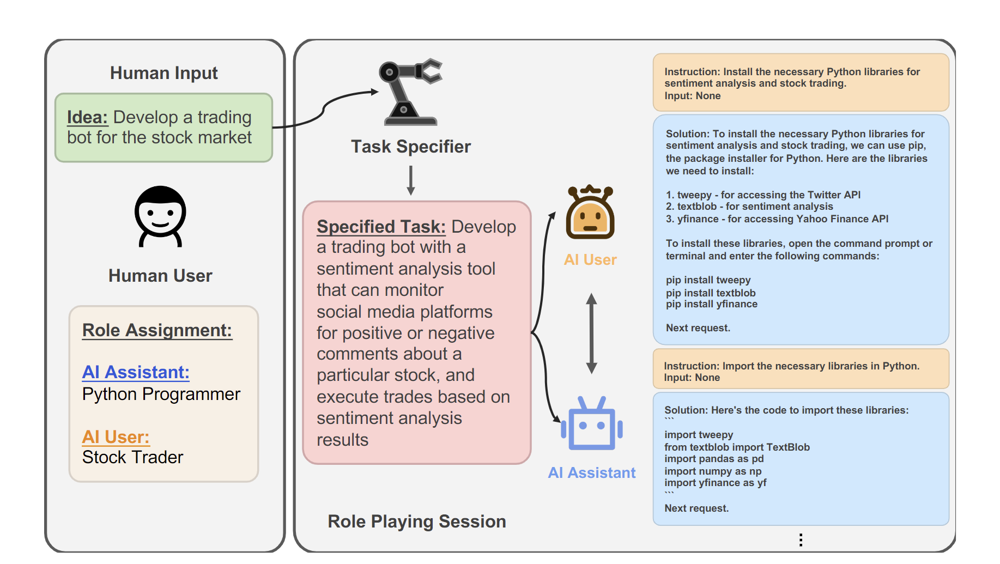

# 角色扮演聊天系统

本项目是论文的langchain复现: 《CAMEL: Communicative Agents for “Mind” Exploration of Large Scale Language Model Society”》，随着会话和聊天语言模型的迅速发展，它们在解决复杂任务方面取得了显著进展。然而，这些模型的成功在很大程度上依赖于人类的输入来引导对话，这既具挑战性又耗时。为了解决这一问题，本项目通过角色扮演促进自治合作并为智能体的“认知”过程提供洞察。通过给定不同的prompt赋予模型不同的角色定位，具体实现流程如下图所示：



<!-- 这里定义了三个角色，分别为“任务细化助手”，“AI助手”，“AI用户”，系统从一个通用任务开始，并将其细化为更具体的任务，交给AI用户和助手完成，AI助手用于引导布置任务，模拟人类的输入来引导AI用户来完成对应的任务。这种可拓展的沟通代理框架促进了AI智能体间的自动合作，并通过定义多个角色明确了多个智能体间的分工。 -->


本项目定义了三个关键角色：“任务细化助手”，“AI助手”和“AI用户”。系统从一个通用任务开始，并将其细化为更具体的任务，交给AI用户和助手完成。AI助手用于引导布置任务，模拟人类的输入来引导AI用户完成对应的任务。这种可拓展的沟通代理框架不仅促进了AI智能体间的自动合作，还通过定义多个角色明确了多个智能体间的分工。

通过使用启动提示来引导聊天代理完成任务，同时保持与人类意图的一致性，我们的方法展示了角色扮演如何用于生成会话数据，以研究聊天代理的行为和能力。这为研究提供了有价值的资源，为会话语言模型的发展和应用开辟了新的道路。


## 功能特点

- **角色定义**：系统清晰地定义了助手和用户的角色。助手是Python程序员，用户是股票交易员。
- **任务细化**：系统从一个通用任务开始，并将其细化为更具体的任务。这是通过使用预定义模板和OpenAI聊天模型来完成的。
- **互动对话**：系统支持助手和用户之间的互动对话。助手根据用户的指示提供解决方案，用户根据他们的需求提供指示。
- **任务完成**：系统旨在通过这种互动对话来完成指定的任务。

## 实现方式

- **CAMELAgent**：系统的核心是 `CAMELAgent` 类，它管理助手和用户之间的对话。
  - **初始化**：代理使用系统消息和OpenAI聊天模型进行初始化。
  - **消息管理**：代理跟踪助手和用户之间交换的消息。
  - **步骤函数**：代理的步骤函数更新消息，与OpenAI模型交互，并返回输出消息。
- **预定义提示**：系统使用预定义的提示来指导助手和用户之间的对话。这些提示确保角色不会翻转，对话保持专注于任务完成。

## 使用方法

要使用系统，只需运行脚本。系统将开始细化任务，然后继续进行助手和用户之间的互动对话。对话将持续进行，直到任务完成。

## 系统要求

- ≥ Python 3.8
- OpenAI API密钥（需存储在`.env`文件中）
- 所需的Python包（如导入语句中所提到的）

### 运行示例

```python
# 定义自己想要的角色
assistant_role_name = "Python Programmer"
user_role_name = "Stock Trader"
task = "Develop a trading bot for the stock market"

# 开始对话    
chat_turn_limit, n = 10, 0
while n < chat_turn_limit:
    n += 1
    user_ai_msg = user_agent.step(assistant_msg)
    user_msg = HumanMessage(content=user_ai_msg.content)
    print(f"AI User ({user_role_name}):{user_msg.content}")

    assistant_ai_msg = assistant_agent.step(user_msg)
    assistant_msg = HumanMessage(content=assistant_ai_msg.content)
    print(f"AI Assistant ({assistant_role_name}):{assistant_msg.content}")

    if "<CAMEL_TASK_DONE>" in user_msg.content:
        break
```
初步运行后果保存在output.md文件中（不同对话结果不同，仅供参考）。


### 注意事项
- 项目需要有效的API密钥来访问OpenAI模型。
- 项目可能需要进一步的测试和优化，以确保稳定性和性能。
- 项目需要添加自己的.env环境，配置对应的OPEN_API_KEY